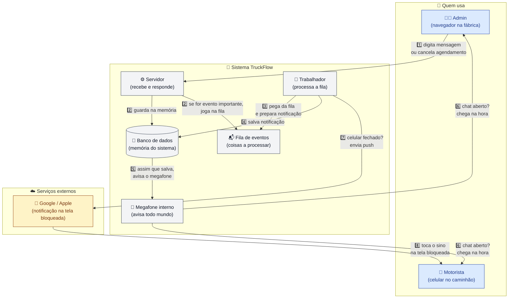
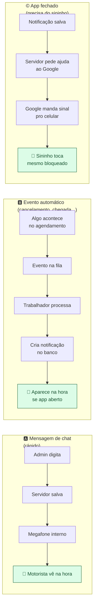
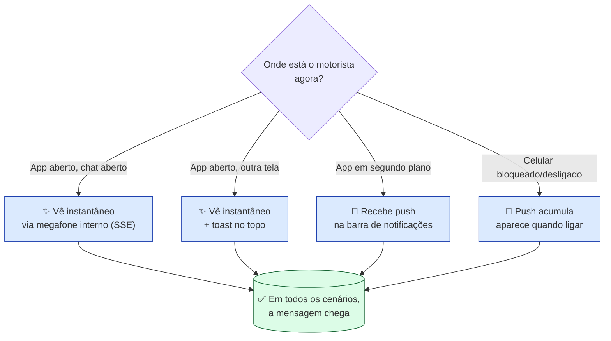
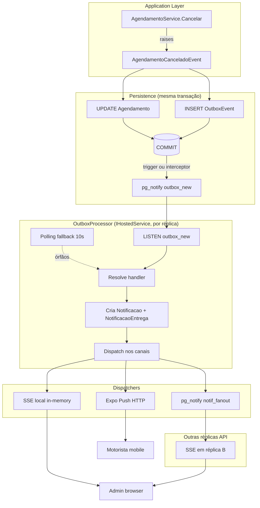
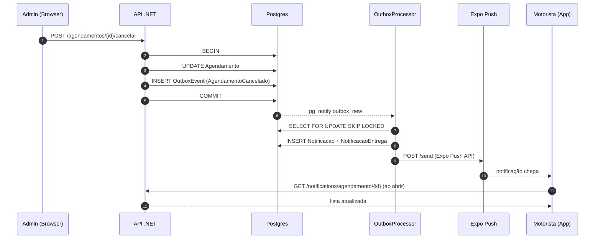

# Notificações realtime via SSE — plano de implementação

> Documento vivo. Cada bloco abaixo é debatido e validado individualmente; quando aprovado, a decisão final é gravada aqui com a data e os trade-offs descartados.
>
> **Referência arquitetural macro**: [ADR-0002 — Sistema de notificações](../adr/0002-design-notificacoes.md).
> Este documento aprofunda **execução**: schema concreto, contratos de código, sequência de operações, observabilidade.

## Sumário

- [Visão geral (diagrama)](#visão-geral-diagrama)
- [Estado atual do código](#estado-atual-do-código)
- [Mapa de blocos de decisão](#mapa-de-blocos-de-decisão)
- [Decisões validadas](#decisões-validadas)

---

## Diagrama explicativo (para apresentação a leigos)

Cola direto no Excalidraw via "Insert → Mermaid to Excalidraw".



### Os 3 caminhos que uma notificação percorre



### Por que precisa de tudo isso



---

## Visão geral (diagrama)

Diagrama em Mermaid (importa direto no Excalidraw via "Insert → Mermaid to Excalidraw"):



Diagrama de sequência do fluxo "admin cancela → motorista vê":



---

## Estado atual do código

Mapeado em 2026-05-24 (revisado após auditoria do backend completo):

### Backend — pipeline SSE pronto ✅

| Componente | Arquivo | Status |
|---|---|---|
| `OutboxEvent` (entidade) | `TruckFlow.Domain/Entities/OutboxEvent.cs` | ✅ |
| `Notificacao`, `NotificacaoEntrega`, `DispositivoUsuario` (entidades) | `TruckFlow.Domain/Entities/` | ✅ |
| `OutboxEventSerializer` | `TruckFlowApi.Infra/Outbox/` | ✅ |
| **Domain events pattern** (`IDomainEvent`, `IDomainEventHandler<T>`) | `TruckFlow.Domain.Events` | ✅ |
| **OutboxProcessorWorker** com `FOR UPDATE SKIP LOCKED`, backoff exponencial 30s→10min, max 8 tentativas | `TruckFlow/Extensions/Notificacao/OutboxProcessorWorker.cs` | ✅ |
| **Endpoint SSE** `GET /v1/notifications/stream` | `TruckFlow/Controllers/NotificationsStreamController.cs` | ✅ |
| **SseNotificationStreamer** — keepalive 25s, headers `X-Accel-Buffering: no`, formato `id:/event:/data:` | `TruckFlow/Extensions/Notificacao/SseNotificationStreamer.cs` | ✅ |
| **INotificationConnectionManager** — `Channel<T>` por usuário | `Application/Notificacoes/` | ✅ |
| **RealtimeNotificationInterceptor** — coleta `Notificacao` Added em `SaveChanges`, dispara `pg_notify('notif_realtime', payload)` no `SavedChanges` (after commit) | `TruckFlowApi.Infra/Database/Interceptors/RealtimeNotificationInterceptor.cs` | ✅ |
| **RealtimeNotificationListener** — `BackgroundService` mantém `LISTEN notif_realtime` com reconnect 5s | `TruckFlow/Extensions/Notificacao/RealtimeNotificationListener.cs` | ✅ |
| `PushDispatcherWorker` + `ReceiptPollerWorker` | `TruckFlow/Extensions/Notificacao/` | ✅ |
| Handler `AgendamentoCanceladoEvent` | `Application/Notificacoes/Handlers/AgendamentoCanceladoNotificacaoHandler.cs` | ✅ |

### Web — conectado no SSE ✅

| Componente | Arquivo | Status |
|---|---|---|
| Composable `useRealtimeNotifications` usando `@microsoft/fetch-event-source` (resolve header `Authorization` em SSE) | `truckflow.app/src/composables/useRealtimeNotifications.ts` | ✅ |
| Reconnect automático com backoff; FatalError em 401/403 pra parar reconnect em loop | mesmo arquivo | ✅ |
| `invalidateQueries` ao receber evento + toast por prioridade | mesmo arquivo | ✅ |

### Mobile — único gap real ❌

| Componente | Status |
|---|---|
| Lib SSE client | ❌ `react-native-sse` não instalado |
| Hook `useRealtimeNotifications` mobile | ❌ Não existe |
| Integração no `AvisarFabricaModal` | ⚠ Hoje usa polling 5s |

### Refinamentos pendentes (não bloqueantes)

| Componente | Status |
|---|---|
| Handlers de eventos além de `AgendamentoCancelado` (Confirmado, Reagendado, MotoristaChegou, MensagemManual) | ❌ |
| Resume com `Last-Event-ID` (header no controller + cursor no streamer + índice) | ❌ |
| `UsuarioPreferenciaNotificacao` (silenciar tipos de evento por usuário) | ❌ — adiar pra pós-MVP |
| Observabilidade: correlation ID atravessando comando → evento → outbox → dispatch | ⚠ Logs existem, falta correlation ID |

---

## Mapa de blocos — status após auditoria

Os blocos 1-7 estão **implementados**. Restam blocos focados em fechar o ciclo mobile + refinamentos.

| # | Bloco | Status |
|---|---|---|
| 1 | Modelo de dados (`OutboxEvent`, `Notificacao`, `NotificacaoEntrega`, `DispositivoUsuario`) | ✅ |
| 2 | Domain events (`IDomainEvent`, `IDomainEventHandler<T>`) | ✅ |
| 3 | Outbox processor (`OutboxProcessorWorker` com SKIP LOCKED + backoff) | ✅ |
| 4 | Worker lifecycle (`BackgroundService` por réplica) | ✅ |
| 5 | NotificationDispatcher (handlers por tipo de evento) | ✅ |
| 6 | SSE endpoint + connection manager (`Channel<T>` por user) | ✅ |
| 7 | Multi-instance fan-out (`pg_notify('notif_realtime', payload)` + `RealtimeNotificationListener`) | ✅ |
| 8 | Auth SSE (Bearer via `fetchEventSource` no web; Bearer via `react-native-sse` no mobile) | ✅ web / ❌ mobile |
| 9 | Reconexão + `Last-Event-ID` resume | ❌ (refinamento) |
| 10 | Frontend hooks (Vue ✅ via `@microsoft/fetch-event-source`; RN ❌) | ⚠ |
| 11 | Observabilidade (correlation ID atravessando o pipeline) | ⚠ falta correlation ID |
| 12 | Teste integração multi-tenant como gate de merge | ❌ |

### Backlog real de execução

1. **[P0]** Instalar `react-native-sse` no mobile + hook `useRealtimeNotifications` espelhando o do web.
2. **[P0]** Plugar hook no `AvisarFabricaModal`: ao receber evento, invalida queryKey; pode baixar polling pra 30s como safety net ou remover.
3. **[P1]** Adicionar handlers para outros eventos: `AgendamentoConfirmado`, `AgendamentoReagendado`, `MotoristaChegou`, `MensagemManualMotorista`, `MensagemManualAdmin`.
4. **[P2]** Resume `Last-Event-ID`: controller lê header → streamer faz query inicial filtrando `Notificacao.Id > cursor` antes de entrar no pump.
5. **[P2]** Correlation ID propagado via `Activity.Current` ou cabeçalho `X-Correlation-Id` atravessando comando → outbox → handler → SSE.
6. **[P3]** Teste de integração com 2 empresas validando isolamento.

---

## Decisões validadas

### 2026-05-24 — Mobile plugado no SSE + 2 novos handlers de evento

**Mobile:**
- Lib: `react-native-sse` (pure JS, sem rebuild nativo).
- Hook: `src/hooks/useRealtimeNotifications.ts` — autenticação via header `Authorization: Bearer {token}` (a lib RN aceita headers, diferente do `EventSource` nativo do web).
- Reativo ao `token` do Zustand (logout fecha conexão; login reabre).
- Listener `notification` → invalida `notificacaoQueryKey`, `notificacaoUnreadCountQueryKey`, `notificacaoAgendamentoQueryKey` + toast por prioridade.
- Chamado uma vez no `app/_layout.tsx` dentro do `InitialLayout`.
- `pollingInterval: 5000` na lib (heartbeat de reconnect interno; não é polling de query).
- `AvisarFabricaModal`: polling do TanStack baixado de 5s pra 30s (apenas safety net se SSE cair silenciosamente).

**Backend — 2 eventos de domínio novos:**
- `AgendamentoEvent.MotoristaChegouEvent` — raised em `Agendamento.RegistrarChegada()`. Handler `MotoristaChegouNotificacaoHandler` notifica **todos admins da empresa** (canal InApp apenas).
- `AgendamentoEvent.AgendamentoReagendadoEvent` — raised em `Agendamento.Reagendar(novaInicio, novaFim)` (novo método de domínio com guard de "datas iguais → no-op" + restrição de "só se motorista já reservou"). Handler `AgendamentoReagendadoNotificacaoHandler` notifica o **motorista** (canais InApp + Push).
- Service `AgendamentoAdminService.Update` agora chama `agendamento.Reagendar(...)` em vez de setar `DataInicio`/`DataFim` direto.
- Ambos os eventos agrupados em `AgendamentoEvent.cs` como `static partial class` com records aninhados (padrão consistente pra eventos relacionados a uma entidade).
- Handlers registrados em `NotificacaoDependencyInjection`.

**Mensagens manuais (`MensagemManualMotorista`/`MensagemManualAdmin`):**
- **Não precisam de outbox/domain event/handler.** O `NotificacaoSendService` grava `Notificacao` direto, e o `RealtimeNotificationInterceptor` pega no `SaveChanges` → `pg_notify` → SSE.
- Caminho mais curto + mais barato.

### Fluxo end-to-end agora ativo

```
[Admin browser]  ─POST /agendamentos/X/cancelar→  [API]
                                                    ├─ Agendamento.Cancelar() raise event
                                                    ├─ OutboxSaveChangesInterceptor → INSERT OutboxEvent
                                                    └─ COMMIT

[OutboxProcessor]  ─FOR UPDATE SKIP LOCKED→  [DB]
                    ├─ resolve handler (AgendamentoCanceladoNotificacaoHandler)
                    ├─ cria Notificacao + NotificacaoEntrega (InApp + Push)
                    └─ SaveChanges
                        ├─ RealtimeNotificationInterceptor → pg_notify('notif_realtime', payload)
                        └─ PushDispatcherWorker → Expo Push (canal Push pendente)

[pg_notify]  ─broadcast→  [todas as réplicas API]
                            └─ RealtimeNotificationListener.OnNotification
                                └─ ConnectionManager.PublishToUser(motoristaUserId, evt)
                                    └─ SSE Channel<T> → mobile/web conectado

[Mobile/Web]  ─useRealtimeNotifications→  invalidateQueries
                                          + toast
```
